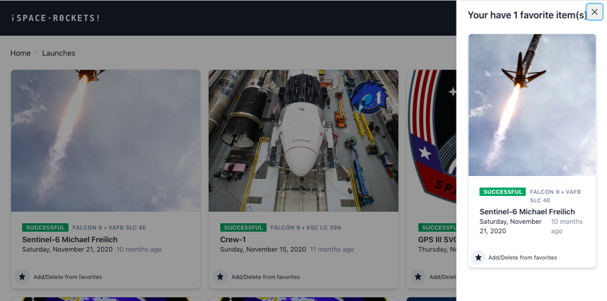

#BUG Date
I had to to some research on chakra UI, I never used it before, but it seemed very similar than Material UI. I added the tooltip. It took me 20 min. I had to be careful to use tooltip from version V.0.8 and not the newest version.
I didn't manage to add the exact user's time, but only the time zone the user is at. This took 1h, but I was not successfull. 

To find user timezone : 
- https://developer.mozilla.org/en-US/docs/Web/JavaScript/Reference/Global_Objects/Intl/DateTimeFormat/DateTimeFormat

- https://stackoverflow.com/questions/6939685/get-client-time-zone-from-browser

- https://blog.logrocket.com/detect-location-and-local-timezone-of-users-in-javascript-3d9523c011b9/

#Add a "favorites"
I started with creating 2 different components for IconButtonFavLauches and iconButtonFavPads. Took me 30 min
I created 2 components for drawers: one for launches and one for launches pads. Took me 30 min
Then I added my logics to add/delete an item to favorites. I also used redux. It was my first time using it. It took me 8+ hours to do some research and have my code to work

#Animation
- I Added animation on title "Space Rockets" using Spring React. It was my first time creating an animation.(took me 3h do to some research on animation in react and add my logic)
- Added hover on fav button using react-hover-animation took me 10 min.
- Added some tests using Cypress (yarn run cypress open), took me 1.5 hours

#Other comments
- In github I would have normally used and work on branches per tasks but as I was working alone I didn't.
- I could have use Storybook but as the project didn't use it in the first place, I didn't